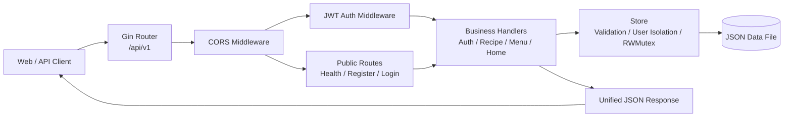

# SignatureMenuBackEnd

SignatureMenuBackEnd 是 SignatureMenu（招牌菜单）的 REST API 服务，为 Web 端提供账号认证、菜谱管理、挑菜与菜单归档、首页数据聚合等能力。

项目使用 Go 与 Gin 构建，以带读写锁的本地 JSON 文件作为轻量持久化方案。它无需额外部署数据库，适合本地开发、个人部署和产品原型验证；接口统一使用 `/api/v1` 前缀，并通过 Bearer Token 隔离不同用户的数据。

## 主要功能

- **账号与身份认证**：注册、登录、退出及个人资料修改；密码使用 bcrypt 哈希保存。
- **JWT 接口保护**：签发 HS256 Token，默认有效期为 7 天，受保护接口从 Token 中识别当前用户。
- **菜谱管理**：菜谱的创建、查询、修改和软删除，并管理食材、步骤、口味、难度、熟练度等信息。
- **菜单管理**：创建及归档菜单、维护待出餐/已出餐状态，并在状态变化时同步菜谱制作次数。
- **首页聚合**：返回菜谱数量、可选菜品、食材统计、常做菜和最近更新菜谱。
- **跨域访问**：通过环境变量维护允许访问 API 的前端来源。
- **开发数据补丁**：可为指定模拟账号生成一批菜谱数据，方便前端联调与界面验证。

## 架构介绍

后端采用按业务模块组织的分层结构。请求先经过 Gin Router 和通用中间件，再进入对应业务 Handler；Handler 负责参数绑定、校验和响应转换，Store 负责数据规则、用户数据隔离及持久化。



### 模块职责

| 模块 | 职责 |
| --- | --- |
| `main.go` | 加载配置、初始化 Store 和 Token Manager，启动 HTTP 服务或执行数据补丁 |
| `internal/app` | 创建 Gin Engine，挂载中间件及各业务路由 |
| `internal/config` | 读取 `.env` 与系统环境变量，并提供默认配置 |
| `internal/middleware` | CORS 处理、Bearer Token 验证及当前用户注入 |
| `internal/auth` | 注册、登录、个人资料以及认证响应 |
| `internal/recipe` | 菜谱与食材统计接口、请求 DTO 和响应转换 |
| `internal/menu` | 菜单 CRUD、出餐状态维护及响应转换 |
| `internal/home` | 首页统计、常做菜和最近菜谱聚合 |
| `internal/store` | 数据模型、校验与规范化、并发控制、软删除和 JSON 持久化 |
| `internal/httpx` | 统一成功及错误响应结构 |
| `internal/patch` | 可重复执行的开发数据补丁 |
| `pkg/token` | JWT 的生成、签名及有效期校验 |

### 请求处理流程

1. Router 根据路径将请求分发到公开路由或受保护路由。
2. CORS 中间件校验请求来源；受保护路由还会校验 `Authorization: Bearer <token>`。
3. Handler 绑定并校验请求参数，从上下文取得当前用户 ID。
4. Store 在读写锁保护下执行查询或变更，并将数据原子替换写入 JSON 文件。
5. `httpx` 将结果封装为统一的 JSON 成功或错误响应。

Store 会按 `user_id` 过滤菜谱和菜单，实现应用级用户数据隔离。菜谱和菜单的删除采用软删除；菜单切换为“已出餐”或从该状态撤回时，会同步增减关联菜谱的制作次数。

## API 概览

除健康检查、注册和登录外，接口均需要 Bearer Token。

| 方法 | 路径 | 说明 | 认证 |
| --- | --- | --- | --- |
| `GET` | `/api/v1/health` | 服务健康检查 | 否 |
| `POST` | `/api/v1/auth/register` | 注册账号并返回 Token | 否 |
| `POST` | `/api/v1/auth/login` | 登录并返回 Token | 否 |
| `POST` | `/api/v1/auth/logout` | 退出登录响应 | 是 |
| `GET` | `/api/v1/me` | 获取当前用户 | 是 |
| `PATCH` | `/api/v1/me` | 修改用户名和昵称 | 是 |
| `GET/POST` | `/api/v1/recipes` | 查询或创建菜谱 | 是 |
| `GET/PUT/DELETE` | `/api/v1/recipes/:id` | 查询、修改或删除菜谱 | 是 |
| `GET` | `/api/v1/ingredients` | 获取食材使用统计 | 是 |
| `GET/POST` | `/api/v1/menus` | 查询或创建菜单 | 是 |
| `GET/PUT/DELETE` | `/api/v1/menus/:id` | 查询、修改或删除菜单 | 是 |
| `PATCH` | `/api/v1/menus/:id/status` | 修改菜单出餐状态 | 是 |
| `GET` | `/api/v1/home/summary` | 获取首页聚合数据 | 是 |

成功响应通常采用以下结构：

```json
{
  "data": {}
}
```

错误响应采用以下结构：

```json
{
  "error": {
    "code": "invalid_input",
    "message": "请求参数不正确"
  }
}
```

## 技术栈

- Go 1.26.4
- Gin 1.12
- bcrypt 密码哈希
- HMAC-SHA256 JWT
- 本地 JSON 文件存储

## 项目结构

```text
SignatureMenuBackEnd/
├── internal/
│   ├── app/          # 路由装配
│   ├── auth/         # 认证与用户接口
│   ├── config/       # 环境配置
│   ├── home/         # 首页聚合接口
│   ├── httpx/        # HTTP 响应封装
│   ├── menu/         # 菜单业务
│   ├── middleware/   # JWT 与 CORS 中间件
│   ├── patch/        # 开发数据补丁
│   ├── recipe/       # 菜谱业务
│   └── store/        # 数据模型与文件存储
├── pkg/token/        # Token 组件
├── data/             # 默认运行时数据目录（不提交 Git）
├── .env              # 本地环境变量（不提交 Git）
├── go.mod
└── main.go
```

## 配置

服务启动时会读取项目根目录下的 `.env`，也支持直接使用系统环境变量。系统环境变量的优先级更高。

```dotenv
APP_PORT=8080
APP_ENV=local
DATA_FILE=data/signature-menu.json
JWT_SECRET=replace-with-a-random-secret
CORS_ORIGINS=http://localhost:5173,http://127.0.0.1:5173
```

| 变量 | 默认值 | 说明 |
| --- | --- | --- |
| `APP_PORT` | `8080` | HTTP 服务端口 |
| `APP_ENV` | `local` | 设为 `production` 时启用 Gin Release 模式 |
| `DATA_FILE` | `data/signature-menu.json` | JSON 数据文件位置 |
| `JWT_SECRET` | 本地开发密钥 | Token 签名密钥；生产环境必须替换 |
| `CORS_ORIGINS` | 本地前端地址列表 | 允许跨域访问的来源，使用英文逗号分隔 |

## 本地运行

环境要求：Go 1.26.4 或与 `go.mod` 兼容的版本。

```bash
go mod download
go run .
```

服务默认监听 `http://localhost:8080`。启动后可以检查健康状态：

```bash
curl http://localhost:8080/api/v1/health
```

也可以构建独立可执行文件：

```bash
go build -o signature-menu-backend .
```

## 数据补丁

### 生成模拟菜谱数据

在 `SignatureMenuBackEnd` 目录下执行：

```bash
go run main.go patch run_mock_data
```

该命令会创建或复用模拟账号 `mock_data / mock123456`，清理该账号下已有的模拟菜谱，并随机生成 50 条真实感菜谱数据。数据会写入当前后端配置使用的 `DATA_FILE`。

> 模拟账号和默认 JWT 密钥仅用于本地开发，请勿直接用于生产环境。

## 存储说明

当前 Store 通过 `sync.RWMutex` 保护进程内并发读写，并使用“写入临时文件后重命名”的方式更新数据文件。该方案部署简单，但不支持多个服务实例同时写入同一个文件；若用于多实例或高并发生产环境，建议将 `internal/store` 替换为数据库实现。
